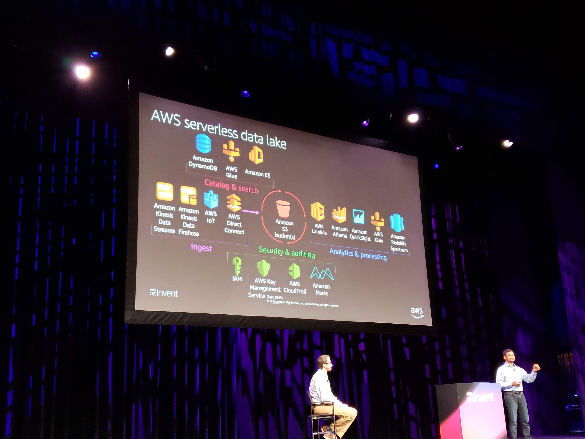
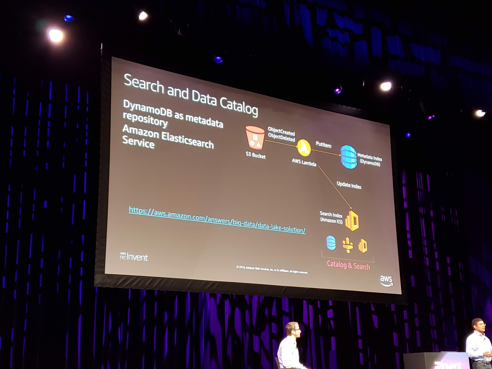
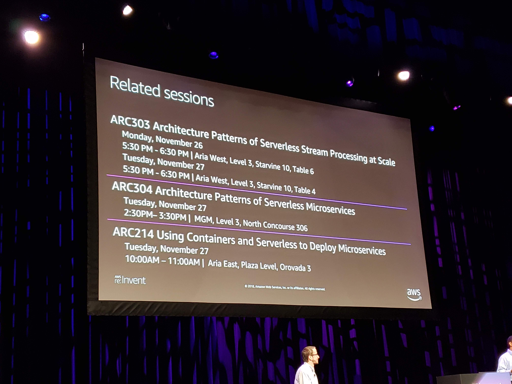

##ARC305-R1 - Serverless Architectural Patterns and Best Practices

#### Drew Dennis and Maitra

#### Intro
- Lambda Power Tuning - Alex Sacalboni
- minimize package size
- prefer simple/smaller frameworks
 use environment variables whenever possible
- AWS SAM  **<-- look into this more**
- Cloud 9 **<-- still needs investigated**
- lambda alias traffic shifting
	- canary deploys
- https://amzn.to/2FjlWA7

#### Serverless Foundations
- Web Application
	- basically what C85, etc, use.
		- s3 + cloudfront for front end
		- api gateway -> lambda -> data
	- options
		- cloudfront in front of api gateway
		- lamda @edge
		- pick the right type of api gateway
		- cognito
		- graphql
			- option to replace REST when it makes sense
			- mqtt
			- AppSync
				- graphql layer over existing resources when fed a schema
- Stream Processing
	- streaming data ingestion
	- enhanced fan out **<-- look into this again**
	- otonomo **<-- look into this**
- Data Lake
	- schema on read
	- aws transfer for sftp
	- amazon macie - data lake analyzer
	- s3 select
	- search and data catalog
	- 
- Machine Learning
	- Amazon Rekognition to scan digital claim forms to see if they look like a claim form
	- comprehend
		- sentiment analysis
		- keywords
	- Lex for routing detectable purpose calls to automated chatbot

#### Misc
- 
- 
