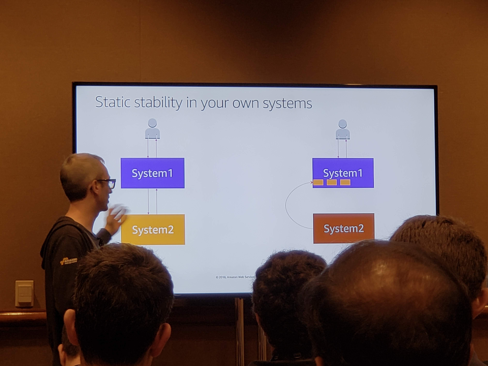
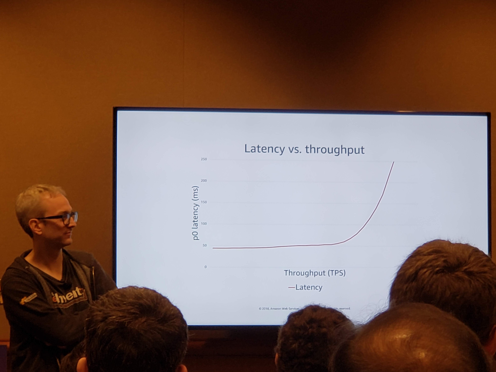

## ARC335-R2 - [REPEAT 2] Failing Successfully in the Cloud: AWS Approach to Resilient Design

#### Becky Weiss - Senior Principal Engineer
#### David Yanacek - Principal Software Engineer, AWS

##### Share failures like you share successes
##### A failure gives you the opportunity to find something you didn't know about your system and research a way to fix it

#### Topic 1: Control Planes and Data Planes
- control plane
	- creates new resources
	- deletes resources
	- updates resources, for example, change how they are configured
	- more complex and therefore more failure/error prone
- data plan
	- the resource's "day job"
	- generally simple and less failure prone

> Control plane and data plane should be loosely coupled such that failures in the control plane do not cause data plane to fail.
>
> This also allows you to scale each independently.

#### Topic 2: Static stability
> Continued stability and availability in the face of impared dependancy
>
> Dependancy !== Destiny

- if you depend on data from another service you can cache that locally and then if the other service goes down you can raise alarms but hold on to your cache longer than normal

#### Topic 3: Avoiding Overload
- look at solutions on how they would operate in various failure scenarios.
- 
	- when your graph starts to turn up dramatically that's your first bottleneck

#### Tools
- auto scaling
	- always looking at service to see if it has enough current capacity
- api gateway
	- throttling
		- slow/limit requests to APIs to prevent downstream overloading so that instead of 100% failure you just have a few impacted users
	- usage plans
		- tie throttling to an identity

###### Pro Tip
- up throttling limits when autoscaling goes up
- reduce throttling limits when autoscaling goes down
- complexity is the enemy of scalability and resilience