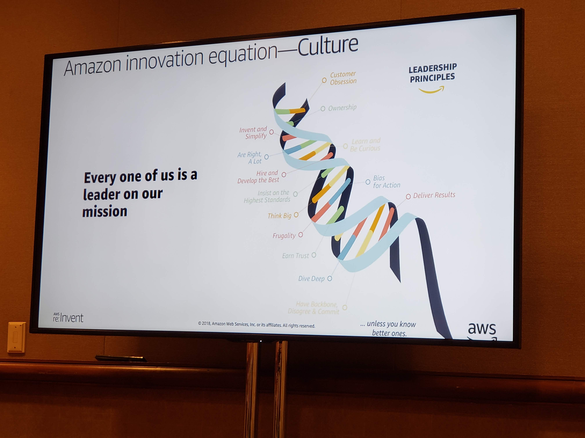

## GPSCT313 - Applying Digital Innovation to Rapid Prototyping

#### Don Southard - GM, R&D and Innovation, AWS
#### Andres Michel - Manager, Solutions Architecture, AWS

- Don's team partners with clients for 2-3 sprints to help power innovation **<-- see about getting a chat with Don**

$$
F(i) = Mechanisms * Architecture^{Culture*Organization}
$$

- Self service environments with few gatekeepers
- loose coupling enable focusing on your particular problem, not the whole environment and upstream/downstream pieces
- Xray for debugging distributed applications
- lambda layers (shared lambda code)

- two pizza team **<-- seems like maybe what were trying with product/platform teams**
	- create a team that can be fed by two pizzas

