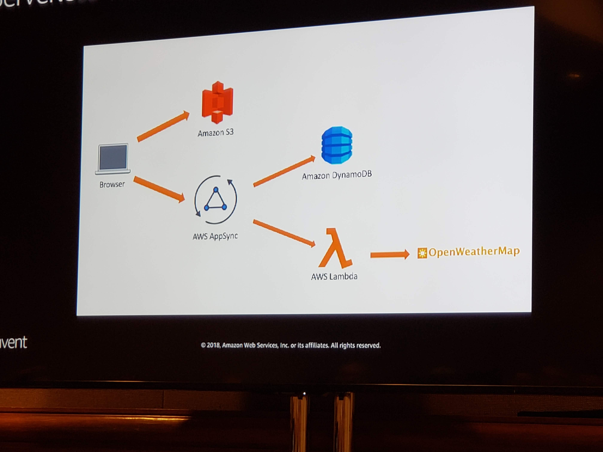

## SRV372-R1 - [REPEAT 1] Build Web Apps with GraphQL, AWS AppSync, and AWS Lambda

#### George Mao ([@georgemao](https://twitter.com/georgemao)) - Specialist Solutions Architect, Serverless

##### Related Streams: 
- Build Web Apps with GraphQL, AWS AppSync, and AWS Lambda : https://www.youtube.com/watch?v=CwLB0BRwIqE
- NEW LAUNCH! Data Driven Apps with GraphQL: AWS AppSync Deep Dive (MBL402) : https://www.youtube.com/watch?v=mQBtbHKSdAQ

#### GraphQL Schema: Type and Query
```javascript
type Destination {
	id: ID!
	description: String!
	state: String!
	city: string!
	zip: String!
	conditions: Weather!
	status: Status
}
```
```javascript
query getDestination {
	getDestination(id: "365847fa"){
		id
		state
		city
		conditions {
			description
			current
			maxTemp
			minTemp
		}
	}
}
```

#### Using REST
- get a destination
	- /api/getDestination
- get destination and its weather conditions
	- api/getDestinationWithWeatherConditions
- get a list of all destinations
	- api/getAllDestinations
- get a list of all destinations and their weather conditions
	- api/getAllDestinationsWithWeatherConditions

https://github.com/aws-samples/aws-serverless-appsync-app  **<-- demo app**


Apollo server has prefetching, is on the roadmap for Appsync

#### auth methods
- api keys
- IAM
- Cognito
- OpenID Connect

#### AppSync
- Velocity templates
- SAM integration possibly on the roadmap
